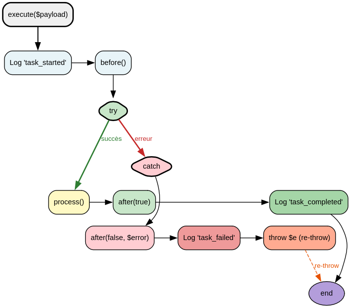
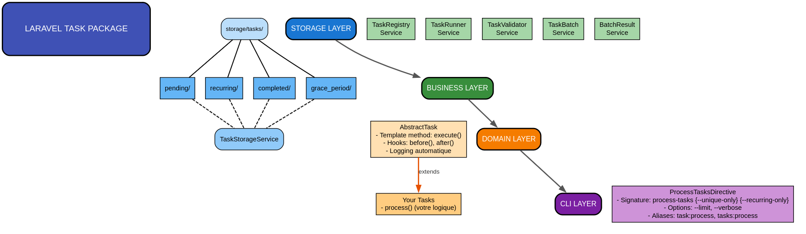

**A lightweight, file-based task system for Laravel with async execution, recurring tasks, and JSON storage.**

[](https://php.net)
[](https://laravel.com)
[](LICENSE)

---

## Introduction

### Le problème

Laravel propose des solutions pour les tâches asynchrones :
- **Queues** : Nécessitent Redis/Beanstalkd/Database, configuration lourde
- **Task Scheduling** : Exécution via cron, pas de gestion des échecs intégrée
- **Jobs** : Lourds, difficilement testables unitairement

### La solution : Laravel Task

**Laravel Task** est un système de tâches asynchrones et récurrentes basé sur des fichiers JSON.

| Problème | Solution Laravel Task |
|----------|----------------------|
| Dépendance à Redis/Beanstalkd | Stockage JSON - pas de base de données |
| Configuration complexe | Zéro configuration, prêt à l'emploi |
| Tests difficiles | Testable unitairement (pas de queue mock) |
| Pas de récurrence native | `delaySeconds` pour les tâches récurrentes |
| Pas de gestion des échecs | Retry automatique avec `maxAttempts` |
| Logs non structurés | Logging via `laravel-logger` |

---

## Installation

```bash
composer require andydefer/laravel-task
```

Le package s'enregistre automatiquement via Laravel.

### Publication de la configuration (optionnel)

```bash
php artisan vendor:publish --tag=task-config
```

---

## Configuration

```php
// config/task.php
return [
    // Chemin de stockage des tâches
    'storage_path' => env('TASK_STORAGE_PATH', storage_path('tasks')),

    // Période de grâce
    'grace_period' => [
        'enabled' => env('TASK_GRACE_PERIOD_ENABLED', true),
        'seconds' => env('TASK_GRACE_PERIOD_SECONDS', 86400), // 24 heures
    ],

    // Traitement par lots
    'batch' => [
        'limit' => env('TASK_BATCH_LIMIT', 1000),   // null ou 0 = illimité
        'order' => env('TASK_BATCH_ORDER', 'oldest'), // 'oldest' ou 'newest'
    ],
];
```

### Variables d'environnement

```env
TASK_STORAGE_PATH=/custom/tasks/path
TASK_GRACE_PERIOD_ENABLED=true
TASK_GRACE_PERIOD_SECONDS=86400
TASK_BATCH_LIMIT=500
TASK_BATCH_ORDER=newest
```

---

## Créer votre première tâche

### 1. Créer la classe de la tâche

```php
<?php

// app/Tasks/ClearUnconfirmedOrdersTask.php

declare(strict_types=1);

namespace App\Tasks;

use AndyDefer\Task\AbstractTask;
use AndyDefer\Task\Records\TaskConfigRecord;
use App\Models\Order;

final class ClearUnconfirmedOrdersTask extends AbstractTask
{
    public function getConfig(): TaskConfigRecord
    {
        return new TaskConfigRecord(
            signature: 'clear-unconfirmed-orders',
            description: 'Clear orders not confirmed after 30 minutes',
            delaySeconds: 300,  // Toutes les 5 minutes
            maxAttempts: 3,
            endAt: null,        // null = récurrente jusqu'à suppression
        );
    }

    protected function process(): void
    {
        // Récupérer les paramètres du payload
        $minutes = $this->payload->payload->first()->minutes ?? 30;
        
        // Logique métier
        $deleted = Order::where('status', 'pending')
            ->where('created_at', '<', now()->subMinutes($minutes))
            ->delete();
        
        $this->info("Deleted {$deleted} unconfirmed orders");
    }
}
```

### 2. Enregistrer la tâche

```php
<?php

namespace App\Console\Commands;

use AndyDefer\Task\Records\TaskPayloadRecord;
use AndyDefer\Task\Services\TaskRegistryService;
use AndyDefer\DomainStructures\Collections\Utility\StrictDataObjectCollection;
use AndyDefer\DomainStructures\Utils\StrictDataObject;
use App\Tasks\ClearUnconfirmedOrdersTask;

class ScheduleTaskCommand extends Command
{
    public function __construct(
        private readonly TaskRegistryService $registry,
    ) {}

    public function handle(): void
    {
        $payload = new TaskPayloadRecord(
            type: 'clear_orders',
            data: StrictDataObjectCollection::from([
                StrictDataObject::from(['minutes' => 30]),
            ]),
        );

        $signature = $this->registry->register(
            taskClass: ClearUnconfirmedOrdersTask::class,
            payload: $payload,
            delaySeconds: 300,
        );
        
        $this->info("Task registered with signature: {$signature}");
    }
}
```

### 3. Exécuter le traitement par lots

```bash
# Exécuter jusqu'à 50 tâches
./vendor/bin/directive process-tasks --limit=50

# Exécuter uniquement les tâches uniques
./vendor/bin/directive process-tasks --unique-only --limit=20

# Avec affichage détaillé des erreurs
./vendor/bin/directive process-tasks --verbose
```

---


## Concepts fondamentaux

### Une tâche = un fichier JSON

```
storage/tasks/
├── pending/          # Tâches uniques en attente
│   └── {uuid}.json
├── recurring/        # Tâches récurrentes (une par signature)
│   └── clear-unconfirmed-orders.json
├── completed/        # Archive par date
│   └── Y-m-d/
│       └── {uuid}.json
└── grace_period/     # Traces des exécutions tardives
    └── {uuid}.json
```

| Dossier | Contenu | Cycle de vie |
|---------|---------|--------------|
| **pending/** | Tâches uniques | Création → Exécution → Archivage |
| **recurring/** | Tâches récurrentes | Création → Exécution → Mise à jour |
| **completed/** | Archive historique | Conservation pour audit |
| **grace_period/** | Traces exécutions tardives | Audit des périodes de grâce |

### Structure d'une tâche

```json
{
    "id": "550e8400-e29b-41d4-a716-446655440000",
    "signature": "clear-unconfirmed-orders",
    "class": "App\\Tasks\\ClearUnconfirmedOrdersTask",
    "payload": {
        "type": "clear_orders",
        "payload": [
            ["minutes", 30]
        ]
    },
    "status": "pending",
    "created_at": "2026-05-24T10:00:00+00:00",
    "start_at": "2026-05-24T10:00:00+00:00",
    "end_at": null,
    "delay_seconds": 300,
    "attempts": 0,
    "max_attempts": 3,
    "last_error": null,
    "enforce_exact_schedule": false
}
```

### Champs clés

| Champ | Description |
|-------|-------------|
| `id` | Identifiant unique (UUID) |
| `signature` | Identifiant lisible (ex: `clear-unconfirmed-orders`) |
| `class` | Classe PHP de la tâche |
| `payload` | Données typées de la tâche |
| `status` | `pending`, `running`, `success`, `failed` |
| `start_at` | Date de début de validité |
| `end_at` | Date de fin (passée = tâche terminée) |
| `delay_seconds` | Délai entre deux exécutions (pour récurrence) |
| `attempts` | Nombre de tentatives effectuées |
| `max_attempts` | Nombre max de tentatives |
| `last_error` | Dernière erreur rencontrée |
| `enforce_exact_schedule` | `true` = exécution stricte (pas de période de grâce) |

---

## Le cycle de vie d'une tâche

### Template method

`AbstractTask` utilise le pattern **Template Method** pour définir le cycle de vie :



### Hooks disponibles

```php
use AndyDefer\Task\AbstractTask;

final class MyTask extends AbstractTask
{
    // Avant l'exécution - initialisation, vérifications
    protected function before(): void
    {
        $this->info("Starting task...");
    }
    
    // Logique métier (obligatoire)
    protected function process(): void
    {
        // Votre code ici
    }
    
    // Après l'exécution - nettoyage, notifications
    protected function after(bool $success, ?string $error = null): void
    {
        if ($success) {
            $this->info('Task completed successfully');
        } else {
            $this->error("Task failed: {$error}");
        }
    }
}
```

---

## Types de tâches

### Tâche unique

S'exécute une seule fois, puis est archivée.

```php
final class SendWelcomeEmailTask extends AbstractTask
{
    public function getConfig(): TaskConfigRecord
    {
        return new TaskConfigRecord(
            signature: 'send-welcome-email',
            description: 'Send welcome email to new user',
            delaySeconds: 0,           // Pas de récurrence
            endAt: date('c', strtotime('+1 hour')), // Expire dans 1 heure
        );
    }
}
```

**Caractéristiques :**
- `delaySeconds = 0`
- `endAt` dans le futur
- Exécutée une fois puis archivée dans `completed/`

### Tâche récurrente

S'exécute à intervalles réguliers.

```php
final class CleanLogsTask extends AbstractTask
{
    public function getConfig(): TaskConfigRecord
    {
        return new TaskConfigRecord(
            signature: 'clean-logs',
            description: 'Clean old log files',
            delaySeconds: 3600,   // Toutes les heures
            endAt: null,          // Jamais (récurrente à vie)
        );
    }
}
```

**Caractéristiques :**
- `delaySeconds > 0`
- `endAt = null`
- Une seule instance par signature
- Exécutée indéfiniment

---

## Période de grâce (Grace Period)

### Qu'est-ce que c'est ?

La période de grâce permet d'exécuter une tâche unique même si elle a dépassé sa date de fin (`endAt`), dans une limite configurable (par défaut 24 heures).

### Pourquoi ?

Dans certains cas, une tâche peut ne pas s'exécuter exactement à l'heure prévue :
- Le processeur de tâches n'a pas été appelé
- Le serveur était en maintenance
- La charge système a retardé l'exécution

Sans période de grâce, ces tâches seraient définitivement perdues.

### Comportement par défaut

| Type de tâche | Période de grâce |
|---------------|------------------|
| Unique (`delaySeconds = 0`) | ✅ Activée (24h) |
| Récurrente (`delaySeconds > 0`) | ❌ Désactivée |
| Avec `enforceExactSchedule = true` | ❌ Désactivée |

### Configuration

```php
// config/task.php
'grace_period' => [
    'enabled' => env('TASK_GRACE_PERIOD_ENABLED', true),
    'seconds' => env('TASK_GRACE_PERIOD_SECONDS', 86400),
],
```

### Exemple d'utilisation

```php
// Tâche unique avec période de grâce (par défaut)
$taskId = $registry->register(
    taskClass: SendReportTask::class,
    payload: $payload,
    endAt: date('c', strtotime('2026-05-24 23:59:59')),
);

// Tâche qui exige une exécution stricte (pas de grâce)
$taskId = $registry->register(
    taskClass: CriticalTask::class,
    payload: $payload,
    endAt: date('c', strtotime('+1 hour')),
    enforceExactSchedule: true,
);
```

---

## Le payload : passer des paramètres typés

### Qu'est-ce qu'un payload ?

Le payload est une structure typée qui transporte les paramètres de la tâche.

```php
use AndyDefer\Task\Records\TaskPayloadRecord;
use AndyDefer\DomainStructures\Collections\Utility\StrictDataObjectCollection;
use AndyDefer\DomainStructures\Utils\StrictDataObject;

$payload = new TaskPayloadRecord(
    type: 'clear_orders',
    data: StrictDataObjectCollection::from([
        StrictDataObject::from(['minutes' => 30, 'force' => true]),
    ]),
);
```

### Accéder aux paramètres dans la tâche

```php
protected function process(): void
{
    $data = $this->payload->payload->first();
    $minutes = $data->minutes ?? 30;
    $force = $data->force ?? false;
    
    $this->info("Clearing orders older than {$minutes} minutes");
}
```

---

## Enregistrer une tâche

### Via le TaskRegistryService

```php
use AndyDefer\Task\Services\TaskRegistryService;
use AndyDefer\Task\Records\TaskPayloadRecord;
use AndyDefer\DomainStructures\Collections\Utility\StrictDataObjectCollection;
use AndyDefer\DomainStructures\Utils\StrictDataObject;

class TaskScheduler
{
    public function __construct(
        private readonly TaskRegistryService $registry,
    ) {}
    
    public function schedule(): void
    {
        $payload = new TaskPayloadRecord(
            type: 'clear_orders',
            data: StrictDataObjectCollection::from([
                StrictDataObject::from(['minutes' => 30]),
            ]),
        );
        
        // Tâche récurrente (retourne la signature)
        $signature = $this->registry->register(
            taskClass: ClearUnconfirmedOrdersTask::class,
            payload: $payload,
            delaySeconds: 300,
        );
        
        // Tâche unique (retourne un UUID)
        $taskId = $this->registry->register(
            taskClass: SendEmailTask::class,
            payload: $payload,
            startAt: now()->toIso8601String(),
            endAt: now()->addHour()->toIso8601String(),
        );
    }
}
```

### Dans un contrôleur

```php
<?php

namespace App\Http\Controllers\Admin;

use AndyDefer\Task\Records\TaskPayloadRecord;
use AndyDefer\Task\Services\TaskRegistryService;
use AndyDefer\DomainStructures\Collections\Utility\StrictDataObjectCollection;
use AndyDefer\DomainStructures\Utils\StrictDataObject;
use App\Tasks\GenerateReportTask;

final class ReportController extends Controller
{
    public function generate(ReportRequest $request, TaskRegistryService $registry): JsonResponse
    {
        $payload = new TaskPayloadRecord(
            type: 'generate_report',
            data: StrictDataObjectCollection::from([
                StrictDataObject::from([
                    'format' => $request->format,
                    'date_from' => $request->date_from,
                    'date_to' => $request->date_to,
                ]),
            ]),
        );
        
        $taskId = $registry->register(
            taskClass: GenerateReportTask::class,
            payload: $payload,
            enforceExactSchedule: $request->boolean('exact_schedule', false),
        );
        
        return response()->json([
            'message' => 'Report generation started',
            'task_id' => $taskId,
        ]);
    }
}
```

---

## Traitement par lots (Batch Processing)

### Commande de base

```bash
# Traiter toutes les tâches (limite configurée par défaut)
./vendor/bin/directive process-tasks

# Traiter jusqu'à 50 tâches
./vendor/bin/directive process-tasks --limit=50

# Uniquement les tâches uniques
./vendor/bin/directive process-tasks --unique-only --limit=20

# Uniquement les tâches récurrentes
./vendor/bin/directive process-tasks --recurring-only --limit=10

# Avec affichage détaillé des erreurs
./vendor/bin/directive process-tasks --verbose --limit=100
```

### Options de la directive

| Option | Description | Défaut |
|--------|-------------|--------|
| `--limit` | Nombre maximum de tâches à traiter | Config `batch.limit` |
| `--unique-only` | Traite uniquement les tâches uniques | `false` |
| `--recurring-only` | Traite uniquement les tâches récurrentes | `false` |
| `--verbose` | Affiche les détails des erreurs | `false` |

### Utilisation programmatique

```php
use AndyDefer\Task\Services\TaskBatchService;

class TaskController
{
    public function process(TaskBatchService $batch): JsonResponse
    {
        $result = $batch->process(50);
        
        return response()->json([
            'unique_success' => $result->uniqueSuccess,
            'unique_failed' => $result->uniqueFailed,
            'recurring_success' => $result->recurringSuccess,
            'recurring_failed' => $result->recurringFailed,
            'errors' => $result->errors->toArray(),
        ]);
    }
}
```

### Résultat du traitement

```php
// BatchResultRecord
echo $result->uniqueSuccess;    // Tâches uniques réussies
echo $result->uniqueFailed;     // Tâches uniques échouées
echo $result->recurringSuccess; // Tâches récurrentes réussies
echo $result->recurringFailed;  // Tâches récurrentes échouées

// Parcourir les erreurs
foreach ($result->errors as $error) {
    echo "{$error->taskId}: {$error->error}\n";
}
```

---

## Traitement des erreurs et réessais

### Configuration des tentatives

```php
public function getConfig(): TaskConfigRecord
{
    return new TaskConfigRecord(
        signature: 'my-task',
        description: 'My task',
        delaySeconds: 300,
        maxAttempts: 5,  // 5 tentatives max
    );
}
```

### Comportement en cas d'échec

```
Tentative 1 → Échec → attempts = 1, réenregistrée
Tentative 2 → Échec → attempts = 2, réenregistrée
Tentative 3 → Échec → attempts = 3, réenregistrée
Tentative 4 → Échec → attempts = 4, réenregistrée
Tentative 5 → Échec → ARCHIVE (FAILED)
```

### Tâche expirée

Si `endAt` est dépassé et qu'il n'y a pas de période de grâce, la tâche est immédiatement archivée sans nouvelle tentative.

---

## Logging structuré

### Logs automatiques

Le package logue automatiquement via `laravel-logger` :
- `task_started` - Début de l'exécution
- `task_completed` - Exécution réussie
- `task_failed` - Exécution échouée
- `task_output` - Messages `info()` et `error()`
- `batch_started` / `batch_completed` - Traitement par lots
- `task_executed_during_grace_period` - Exécution pendant période de grâce

### Logs personnalisés

```php
protected function process(): void
{
    $this->info("Processing started");
    $this->info("Step 1 complete");
    
    if ($error) {
        $this->error("Something went wrong");
    }
}
```

### Consulter les logs

```bash
# Afficher les logs d'exécution d'une tâche
grep "clear-unconfirmed-orders" storage/logs/structured/*/*.jsonl

# Afficher les erreurs
grep "task_failed" storage/logs/structured/*/*.jsonl

# Afficher les logs de batch
grep "batch" storage/logs/structured/*/*.jsonl

# Afficher les exécutions pendant période de grâce
grep "grace_period" storage/logs/structured/*/*.jsonl
```

---

## Tests unitaires

### Tester une tâche

```php
<?php

namespace Tests\Unit\Tasks;

use AndyDefer\DomainStructures\Collections\Utility\StrictDataObjectCollection;
use AndyDefer\DomainStructures\Utils\StrictDataObject;
use AndyDefer\Logger\Logger;
use AndyDefer\Task\Records\TaskPayloadRecord;
use App\Tasks\ClearUnconfirmedOrdersTask;
use Tests\UnitTestCase;
use App\Models\Order;

final class ClearUnconfirmedOrdersTaskTest extends UnitTestCase
{
    private ClearUnconfirmedOrdersTask $task;

    protected function setUp(): void
    {
        parent::setUp();
        
        $logger = $this->createMock(Logger::class);
        $this->task = new ClearUnconfirmedOrdersTask();
        $this->task->setLogger($logger);
        $this->task->setTaskId('test-123');
        $this->task->setSignature('clear-unconfirmed-orders');
    }

    public function test_execute_deletes_unconfirmed_orders(): void
    {
        // Arrange
        Order::create([
            'status' => 'pending',
            'created_at' => now()->subMinutes(40),
        ]);
        
        $payload = new TaskPayloadRecord(
            type: 'clear_orders',
            data: StrictDataObjectCollection::from([
                StrictDataObject::from(['minutes' => 30]),
            ]),
        );
        
        // Act
        $this->task->execute($payload);
        
        // Assert
        $this->assertDatabaseCount('orders', 0);
    }
}
```

### Tester le TaskBatchService

```php
use AndyDefer\Task\Services\TaskBatchService;

public function test_process_returns_batch_result(): void
{
    $result = $this->batch->process(10);
    
    $this->assertIsInt($result->uniqueSuccess);
    $this->assertIsInt($result->uniqueFailed);
    $this->assertInstanceOf(TaskErrorCollection::class, $result->errors);
}
```

---

## Architecture technique

### Diagramme d'architecture



### Composants

| Composant | Rôle |
|-----------|------|
| `AbstractTask` | Classe de base avec template method et hooks |
| `TaskStorageService` | Stockage JSON (pending/, recurring/, completed/, grace_period/) |
| `TaskRunnerService` | Exécution des tâches et gestion des tentatives |
| `TaskValidatorService` | Validation des tâches (dates, statuts, classes, période de grâce) |
| `TaskRegistryService` | Enregistrement des nouvelles tâches |
| `TaskBatchService` | Traitement par lots (orchestration) |
| `BatchResultService` | Construction immuable des résultats de batch |
| `ProcessTasksDirective` | Directive CLI pour le traitement par lots |

---

## Licence

MIT © [Andy Defer](https://github.com/andydefer)
