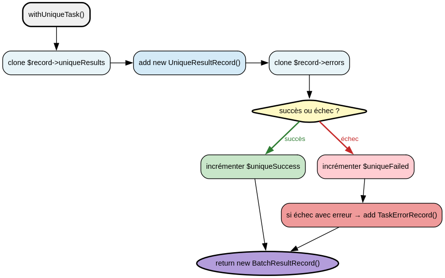

# BatchResultService - Référence Technique

## Description

Service immuable pour construire des résultats de traitement par lots en ajoutant des résultats de tâches uniques ou récurrentes.

## Hiérarchie

```
BatchResultService
```

La classe n'étend aucune classe parente et n'implémente aucune interface.

## Rôle principal

Fournir des opérations immutables pour enrichir un `BatchResultRecord` avec des résultats de tâches. Chaque méthode prend un enregistrement existant, le clone, y ajoute un résultat, et retourne une nouvelle instance. Aucune méthode ne modifie l'état interne.

## API / Méthodes publiques

### `withUniqueTask(BatchResultRecord $record, string $id, bool $success, ?string $error = null): BatchResultRecord`

Ajoute le résultat d'une tâche unique (non récurrente) au lot.

| Paramètre | Type | Description |
|-----------|------|-------------|
| `$record` | `BatchResultRecord` | Enregistrement de résultat actuel |
| `$id` | `string` | Identifiant unique de la tâche |
| `$success` | `bool` | Indique si la tâche a réussi |
| `$error` | `string|null` | Message d'erreur si la tâche a échoué |

**Retourne :** `BatchResultRecord` - Nouvelle instance avec la tâche ajoutée

**Exemple :**
```php
$service = new BatchResultService();
$record = $service->withUniqueTask($emptyRecord, 'task-1', true);
```

### `withRecurringTask(BatchResultRecord $record, string $signature, bool $success, ?string $error = null): BatchResultRecord`

Ajoute le résultat d'une tâche récurrente au lot.

| Paramètre | Type | Description |
|-----------|------|-------------|
| `$record` | `BatchResultRecord` | Enregistrement de résultat actuel |
| `$signature` | `string` | Signature unique de la tâche récurrente |
| `$success` | `bool` | Indique si la tâche a réussi |
| `$error` | `string|null` | Message d'erreur si la tâche a échoué |

**Retourne :** `BatchResultRecord` - Nouvelle instance avec la tâche ajoutée

**Exemple :**
```php
$service = new BatchResultService();
$record = $service->withRecurringTask($emptyRecord, 'recurring-1', false, 'Timeout');
```

## Cas d'utilisation

### Cas 1 : Construction séquentielle d'un résultat de lot

```php
<?php

declare(strict_types=1);

use AndyDefer\Task\Services\BatchResultService;
use AndyDefer\Task\Records\BatchResultRecord;
use AndyDefer\Task\ValueObjects\Iso8601DateTime;
use AndyDefer\Task\Collections\UniqueResultCollection;
use AndyDefer\Task\Collections\RecurringResultCollection;
use AndyDefer\Task\Collections\TaskErrorCollection;

$service = new BatchResultService();

// Créer un enregistrement vide
$emptyRecord = new BatchResultRecord(
    startedAt: new Iso8601DateTime(),
    uniqueSuccess: 0,
    uniqueFailed: 0,
    recurringSuccess: 0,
    recurringFailed: 0,
    uniqueResults: new UniqueResultCollection(),
    recurringResults: new RecurringResultCollection(),
    errors: new TaskErrorCollection(),
);

// Ajouter des résultats
$record = $service->withUniqueTask($emptyRecord, 'task-1', true);
$record = $service->withUniqueTask($record, 'task-2', false, 'Connection failed');
$record = $service->withRecurringTask($record, 'recurring-1', true);

echo $record->uniqueSuccess;  // 1
echo $record->uniqueFailed;   // 1
echo $record->recurringSuccess; // 1
```

### Cas 2 : Traitement par lots avec agrégation

```php
<?php

declare(strict_types=1);

use AndyDefer\Task\Services\BatchResultService;

function processBatch(array $tasks, BatchResultService $service): BatchResultRecord
{
    $record = createEmptyBatchResult();

    foreach ($tasks as $task) {
        try {
            $task->execute();
            $record = $service->withUniqueTask($record, $task->getId(), true);
        } catch (\Exception $e) {
            $record = $service->withUniqueTask($record, $task->getId(), false, $e->getMessage());
        }
    }

    return $record;
}
```

### Cas 3 : Immutabilité garantie

```php
<?php

declare(strict_types=1);

use AndyDefer\Task\Services\BatchResultService;

$service = new BatchResultService();
$original = createEmptyBatchResult();

$modified = $service->withUniqueTask($original, 'task-1', true);

// L'original reste inchangé
echo $original->uniqueSuccess;  // 0
echo $modified->uniqueSuccess;  // 1
```

## Flux d'exécution




## Gestion des erreurs

| Situation | Comportement |
|-----------|--------------|
| Succès d'une tâche | `uniqueSuccess` incrémenté |
| Échec sans message d'erreur | `uniqueFailed` incrémenté, aucune erreur stockée |
| Échec avec message d'erreur | `uniqueFailed` incrémenté, `TaskErrorRecord` ajouté |
| `$error = null` | Aucune erreur n'est stockée dans la collection |

## Intégration

### Dépendances

```
BatchResultService
    ├── BatchResultRecord (paramètre et retour)
    ├── UniqueResultRecord (création)
    ├── RecurringResultRecord (création)
    └── TaskErrorRecord (création conditionnelle)
```

### Avec TaskBatchService

```php
class TaskBatchService
{
    public function __construct(
        private readonly BatchResultService $batchResultService,
        // ...
    ) {}

    private function processUniqueTasks(BatchResultRecord $result, ?int $limit): BatchResultRecord
    {
        foreach ($tasks as $task) {
            $result = $this->batchResultService->withUniqueTask($result, $task->id, $success, $error);
        }
        return $result;
    }
}
```

## Performance

| Opération | Complexité | Notes |
|-----------|------------|-------|
| `withUniqueTask()` | O(1) + clonage des collections | Clonage superficiel (shallow copy) |
| `withRecurringTask()` | O(1) + clonage des collections | Clonage superficiel (shallow copy) |
| Clonage de `TypedCollection` | O(n) pour n éléments | Les collections sont clonées intégralement |

L'immutabilité garantit l'absence d'effets de bord, mais chaque ajout crée une nouvelle instance et clone les collections.

## Compatibilité

| Version PHP | Support |
|-------------|---------|
| PHP 8.2+ | ✅ Requis (readonly properties) |
| PHP 8.1 | ✅ Complet |
| PHP 8.0 | ❌ (readonly properties non supportées) |

## Exemple complet

```php
<?php

declare(strict_types=1);

use AndyDefer\Task\Services\BatchResultService;
use AndyDefer\Task\Records\BatchResultRecord;
use AndyDefer\Task\Records\UniqueResultRecord;
use AndyDefer\Task\Records\RecurringResultRecord;
use AndyDefer\Task\Records\TaskErrorRecord;
use AndyDefer\Task\Collections\UniqueResultCollection;
use AndyDefer\Task\Collections\RecurringResultCollection;
use AndyDefer\Task\Collections\TaskErrorCollection;
use AndyDefer\Task\ValueObjects\Iso8601DateTime;

// 1. Créer un enregistrement vide
$emptyRecord = new BatchResultRecord(
    startedAt: new Iso8601DateTime(),
    uniqueSuccess: 0,
    uniqueFailed: 0,
    recurringSuccess: 0,
    recurringFailed: 0,
    uniqueResults: new UniqueResultCollection(),
    recurringResults: new RecurringResultCollection(),
    errors: new TaskErrorCollection(),
);

// 2. Initialiser le service
$service = new BatchResultService();

// 3. Ajouter des résultats de tâches
$record = $service->withUniqueTask($emptyRecord, 'unique-1', true);
$record = $service->withUniqueTask($record, 'unique-2', false, 'Task failed');
$record = $service->withRecurringTask($record, 'recurring-1', true);
$record = $service->withRecurringTask($record, 'recurring-2', false, 'Recurring task failed');

// 4. Lire les résultats
echo "Unique tasks:\n";
echo "  Success: {$record->uniqueSuccess}\n";
echo "  Failed:  {$record->uniqueFailed}\n";

echo "\nRecurring tasks:\n";
echo "  Success: {$record->recurringSuccess}\n";
echo "  Failed:  {$record->recurringFailed}\n";

echo "\nTotal: " . ($record->uniqueSuccess + $record->uniqueFailed + 
                   $record->recurringSuccess + $record->recurringFailed) . " tasks\n";

// 5. Afficher les erreurs
if ($record->errors->isNotEmpty()) {
    echo "\nErrors:\n";
    foreach ($record->errors as $error) {
        echo "  - {$error->taskId}: {$error->error}\n";
    }
}
```

**Sortie :**
```
Unique tasks:
  Success: 1
  Failed:  1

Recurring tasks:
  Success: 1
  Failed:  1

Total: 4 tasks

Errors:
  - unique-2: Task failed
  - recurring-2: Recurring task failed
```

## Voir aussi

- `BatchResultRecord` - Record contenant les résultats
- `UniqueResultRecord` - Résultat d'une tâche unique
- `RecurringResultRecord` - Résultat d'une tâche récurrente
- `TaskErrorRecord` - Enregistrement d'erreur
- `TaskBatchService` - Service de traitement par lots qui utilise `BatchResultService`

---