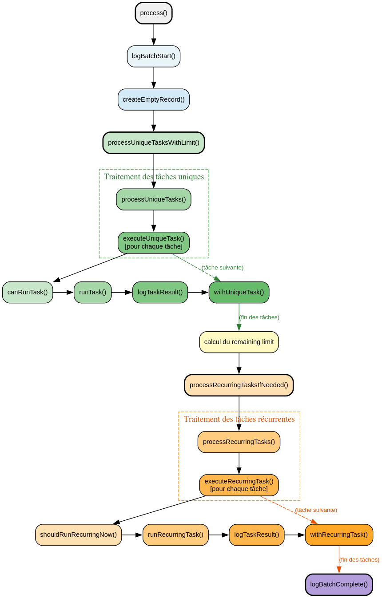

# TaskBatchService - Référence Technique

## Description

Service qui orchestre l'exécution par lots de tâches planifiées, avec prise en charge des tâches uniques et récurrentes, des limites configurables et du filtrage.

## Hiérarchie

```
TaskProcessorInterface
    └── TaskBatchService
```

## Rôle principal

Orchestrer le traitement des tâches en attente en respectant les limites configurées, en filtrant par type (unique/récurrent) et en agrégeant les résultats dans un `BatchResultRecord` immuable.

## API / Méthodes publiques

### `__construct(TaskStorageService $storage, TaskRunnerService $runner, TaskValidatorService $validator, Logger $logger, BatchResultService $batchResultService, TaskConfig $config): void`

Injecte les dépendances nécessaires au traitement des tâches.

| Paramètre | Type | Description |
|-----------|------|-------------|
| `$storage` | `TaskStorageService` | Service de persistance des tâches |
| `$runner` | `TaskRunnerService` | Service d'exécution des tâches |
| `$validator` | `TaskValidatorService` | Service de validation des tâches |
| `$logger` | `Logger` | Service de journalisation |
| `$batchResultService` | `BatchResultService` | Service de construction des résultats |
| `$config` | `TaskConfig` | Configuration du traitement par lots |

### `process(?int $limit = null): BatchResultRecord`

Traite toutes les tâches en attente (uniques et récurrentes) en respectant la limite spécifiée.

| Paramètre | Type | Description |
|-----------|------|-------------|
| `$limit` | `int|null` | Nombre maximum de tâches à traiter (null = pas de limite) |

**Retourne :** `BatchResultRecord` - Résultat du traitement

**Exemple :**
```php
$result = $batchService->process(50);
echo $result->uniqueSuccess;    // 35
echo $result->recurringSuccess; // 15
```

### `processUniqueOnly(?int $limit = null): BatchResultRecord`

Traite uniquement les tâches uniques (non récurrentes).

| Paramètre | Type | Description |
|-----------|------|-------------|
| `$limit` | `int|null` | Nombre maximum de tâches à traiter |

**Retourne :** `BatchResultRecord` - Résultat du traitement

**Exemple :**
```php
$result = $batchService->processUniqueOnly(25);
```

### `processRecurringOnly(?int $limit = null): BatchResultRecord`

Traite uniquement les tâches récurrentes.

| Paramètre | Type | Description |
|-----------|------|-------------|
| `$limit` | `int|null` | Nombre maximum de tâches à traiter |

**Retourne :** `BatchResultRecord` - Résultat du traitement

**Exemple :**
```php
$result = $batchService->processRecurringOnly(10);
```

## Flux d'exécution




## Cas d'utilisation

### Cas 1 : Traitement standard avec limite

```php
<?php

declare(strict_types=1);

$batchService = app(TaskBatchService::class);

// Traite jusqu'à 100 tâches
$result = $batchService->process(100);

echo "Tâches uniques réussies : {$result->uniqueSuccess}\n";
echo "Tâches uniques échouées : {$result->uniqueFailed}\n";
echo "Tâches récurrentes réussies : {$result->recurringSuccess}\n";
echo "Tâches récurrentes échouées : {$result->recurringFailed}\n";
```

### Cas 2 : Traitement sans limite

```php
<?php

declare(strict_types=1);

// Traite toutes les tâches disponibles
$result = $batchService->process();
```

### Cas 3 : Traitement séparé par type

```php
<?php

declare(strict_types=1);

// Traitement prioritaire des tâches uniques
$uniqueResult = $batchService->processUniqueOnly(50);

// Traitement des tâches récurrentes avec le reste du quota
$remaining = 100 - $uniqueResult->getTotal();
$recurringResult = $batchService->processRecurringOnly($remaining);
```

## Gestion des erreurs

| Situation | Comportement | Code retour |
|-----------|--------------|-------------|
| Tâche non exécutable (état invalide) | Log comme échec, continue | `false` dans le résultat |
| Exception pendant l'exécution | Capture, log, marque comme échec | `false` dans le résultat |
| Limite atteinte | Arrête le traitement | Résultat partiel |
| Pas de tâches en attente | Retourne un résultat vide | Compteurs à zéro |

## Intégration

### Dépendances

```
TaskBatchService
    ├── TaskStorageService (persistance)
    ├── TaskRunnerService (exécution)
    ├── TaskValidatorService (validation)
    ├── BatchResultService (agrégation)
    ├── TaskConfig (configuration)
    └── Logger (journalisation)
```

### Avec Laravel

```php
// Dans un contrôleur
public function handleBatch(Request $request): JsonResponse
{
    $batch = app(TaskBatchService::class);
    $result = $batch->process($request->input('limit', 50));
    
    return response()->json($result->toArray());
}
```

## Performance

| Opération | Complexité | Notes |
|-----------|------------|-------|
| `process()` | O(n) | n = nombre de tâches traitées |
| `processUniqueOnly()` | O(n) | n = nombre de tâches uniques |
| `processRecurringOnly()` | O(n) | n = nombre de tâches récurrentes |
| Recherche des tâches | O(k log k) | Tri par timestamp des fichiers |
| Agrégation des résultats | O(1) par tâche | Clonage des collections immuables |

## Compatibilité

| Version PHP | Support |
|-------------|---------|
| PHP 8.2+ | ✅ Requis (readonly properties) |
| PHP 8.1 | ✅ Complet |
| PHP 8.0 | ❌ |

## Exemple complet

```php
<?php

declare(strict_types=1);

use AndyDefer\Task\Services\TaskBatchService;
use AndyDefer\Task\ValueObjects\Iso8601DateTime;

final class BatchProcessor
{
    public function __construct(
        private readonly TaskBatchService $batch
    ) {}

    public function processDailyBatch(): array
    {
        $startedAt = new Iso8601DateTime();
        
        // Traitement des tâches prioritaires
        $priorityResult = $this->batch->processUniqueOnly(100);
        
        // Traitement des tâches normales
        $normalResult = $this->batch->processRecurringOnly(200);
        
        $endedAt = new Iso8601DateTime();
        
        return [
            'started_at' => $startedAt->getValue(),
            'ended_at' => $endedAt->getValue(),
            'unique_success' => $priorityResult->uniqueSuccess,
            'unique_failed' => $priorityResult->uniqueFailed,
            'recurring_success' => $normalResult->recurringSuccess,
            'recurring_failed' => $normalResult->recurringFailed,
            'errors' => $normalResult->errors->toArray(),
        ];
    }
}

// Utilisation
$processor = new BatchProcessor(app(TaskBatchService::class));
$result = $processor->processDailyBatch();
```

## Voir aussi

- `TaskProcessorInterface` - Interface implémentée
- `BatchResultRecord` - Record de résultat
- `TaskStorageService` - Service de persistance
- `TaskRunnerService` - Service d'exécution
- `TaskValidatorService` - Service de validation
- `TaskConfig` - Configuration du système

---
