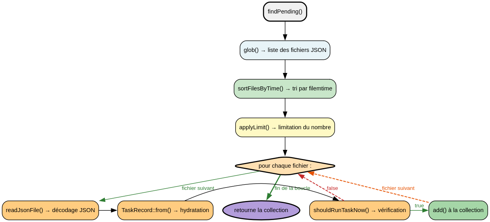

# TaskStorageService - Référence Technique

## Description

Service de persistance pour les tâches uniques et récurrentes. Stocke les données au format JSON dans une structure de dossiers organisée par état (en attente, récurrent, terminé).

## Hiérarchie

```
TaskStorageService
```

La classe n'étend aucune classe parente et n'implémente aucune interface.

## Rôle principal

Fournir un accès type-safe au stockage persistant des tâches via des fichiers JSON. Gère automatiquement la création des dossiers, le tri des fichiers et l'application des limites.

## API / Méthodes publiques

### `__construct(TaskConfig $config): void`

Injecte la configuration du système de tâches.

| Paramètre | Type | Description |
|-----------|------|-------------|
| `$config` | `TaskConfig` | Configuration contenant les chemins de stockage |

### `savePending(TaskRecord $task): void`

Sauvegarde une tâche unique en attente.

| Paramètre | Type | Description |
|-----------|------|-------------|
| `$task` | `TaskRecord` | Tâche unique à sauvegarder |

**Exemple :**
```php
$storage->savePending($task);
```

### `findPending(?int $limit = null, string $order = 'oldest'): TaskRecordCollection`

Récupère les tâches uniques prêtes à être exécutées.

| Paramètre | Type | Description |
|-----------|------|-------------|
| `$limit` | `int|null` | Nombre maximum de tâches (null = pas de limite) |
| `$order` | `string` | Ordre de tri (`'oldest'` ou `'newest'`) |

**Retourne :** `TaskRecordCollection` - Collection des tâches prêtes

**Exemple :**
```php
$tasks = $storage->findPending(10, 'oldest');
foreach ($tasks as $task) {
    echo $task->id;
}
```

### `deletePending(string $id): void`

Supprime une tâche unique en attente.

| Paramètre | Type | Description |
|-----------|------|-------------|
| `$id` | `string` | Identifiant de la tâche |

### `moveToCompleted(TaskRecord $task, bool $success = true): void`

Déplace une tâche terminée vers le dossier des tâches complétées.

| Paramètre | Type | Description |
|-----------|------|-------------|
| `$task` | `TaskRecord` | Tâche à déplacer |
| `$success` | `bool` | Indique si la tâche a réussi (pour logging) |

### `saveRecurring(RecurringTaskRecord $task): void`

Sauvegarde une tâche récurrente.

| Paramètre | Type | Description |
|-----------|------|-------------|
| `$task` | `RecurringTaskRecord` | Tâche récurrente à sauvegarder |

### `findRecurring(?int $limit = null, string $order = 'oldest'): RecurringTaskRecordCollection`

Récupère les tâches récurrentes prêtes à être exécutées.

| Paramètre | Type | Description |
|-----------|------|-------------|
| `$limit` | `int|null` | Nombre maximum de tâches |
| `$order` | `string` | Ordre de tri (`'oldest'` ou `'newest'`) |

**Retourne :** `RecurringTaskRecordCollection` - Collection des tâches récurrentes prêtes

### `getRecurring(string $signature): ?RecurringTaskRecord`

Récupère une tâche récurrente par sa signature.

| Paramètre | Type | Description |
|-----------|------|-------------|
| `$signature` | `string` | Signature unique de la tâche |

**Retourne :** `RecurringTaskRecord|null` - La tâche ou `null` si non trouvée

### `updateRecurringAfterRun(RecurringTaskRecord $task, bool $success, ?string $error = null): void`

Met à jour une tâche récurrente après son exécution.

| Paramètre | Type | Description |
|-----------|------|-------------|
| `$task` | `RecurringTaskRecord` | Tâche à mettre à jour |
| `$success` | `bool` | Indique si l'exécution a réussi |
| `$error` | `string|null` | Message d'erreur si échec |

### `deleteRecurring(string $signature): void`

Supprime une tâche récurrente.

### `getAllRecurring(): RecurringTaskRecordCollection`

Récupère toutes les tâches récurrentes (sans filtre de temps).

### `getAllPending(): TaskRecordCollection`

Récupère toutes les tâches uniques (sans filtre de temps).

## Cas d'utilisation

### Cas 1 : Sauvegarde et récupération d'une tâche unique

```php
<?php

declare(strict_types=1);

$task = new TaskRecord(
    id: '550e8400-e29b-41d4-a716-446655440000',
    signature: 'send-email',
    class: SendEmailTask::class,
    payload: $payload,
    status: TaskStatus::PENDING,
    createdAt: date('c'),
    startAt: date('c'),
    endAt: date('c', strtotime('+1 hour')),
    delaySeconds: 0,
    attempts: 0,
    maxAttempts: 3,
);

$storage->savePending($task);
$pending = $storage->findPending();

echo $pending->count(); // 1
```

### Cas 2 : Récupération avec limite et tri

```php
<?php

declare(strict_types=1);

// Récupère les 10 tâches les plus anciennes
$oldestTasks = $storage->findPending(10, 'oldest');

// Récupère les 5 tâches les plus récentes
$newestTasks = $storage->findPending(5, 'newest');
```

### Cas 3 : Gestion des tâches récurrentes

```php
<?php

declare(strict_types=1);

$recurringTask = new RecurringTaskRecord(
    signature: 'cleanup-logs',
    class: CleanupLogsTask::class,
    payload: $payload,
    startAt: date('c', strtotime('-1 hour')),
    endAt: null,
    delaySeconds: 3600,
    lastRunAt: null,
    nextRunAt: date('c'),
    successCount: 0,
    failureCount: 0,
);

$storage->saveRecurring($recurringTask);

// Après exécution
$storage->updateRecurringAfterRun($recurringTask, true);

$updated = $storage->getRecurring('cleanup-logs');
echo $updated->successCount; // 1
echo $updated->nextRunAt;    // now + 3600 seconds
```

## Flux d'exécution



## Gestion des erreurs

| Situation | Comportement |
|-----------|--------------|
| Dossier inexistant | Création automatique (`ensureDirectories()`) |
| Fichier JSON invalide | Ignoré (continue) |
| `glob()` retourne `false` | Retourne une collection vide |
| Fichier inexistant | `getRecurring()` retourne `null` |

## Structure des dossiers

```
storage_path('tasks')/
├── pending/
│   ├── {uuid}.json
│   └── ...
├── recurring/
│   ├── {signature}.json
│   └── ...
└── completed/
    └── Y-m-d/
        ├── {uuid}.json
        └── ...
```

## Performance

| Opération | Complexité | Notes |
|-----------|------------|-------|
| `savePending()` | O(1) | Écriture directe |
| `findPending()` | O(n log n) | Tri des fichiers par timestamp |
| `findPending()` avec limite | O(k log k) | k = min(n, limit) |
| `getRecurring()` | O(1) | Accès direct par signature |
| `getAllRecurring()` | O(n) | Parcourt tous les fichiers |

## Compatibilité

| Version PHP | Support |
|-------------|---------|
| PHP 8.2+ | ✅ Requis (readonly properties) |
| PHP 8.1 | ✅ Complet |
| PHP 8.0 | ❌ |

## Exemple complet

```php
<?php

declare(strict_types=1);

use AndyDefer\Task\Services\TaskStorageService;
use AndyDefer\Task\Configs\TaskConfig;
use AndyDefer\Task\Enums\TaskStatus;
use AndyDefer\Task\Records\TaskRecord;
use AndyDefer\Task\Records\TaskPayloadRecord;

// 1. Configuration
$config = new TaskConfig();
$storage = new TaskStorageService($config);

// 2. Création d'une tâche
$task = new TaskRecord(
    id: '550e8400-e29b-41d4-a716-446655440000',
    signature: 'backup-database',
    class: BackupDatabaseTask::class,
    payload: new TaskPayloadRecord(type: 'backup', payload: $payloadCollection),
    status: TaskStatus::PENDING,
    createdAt: date('c'),
    startAt: date('c'),
    endAt: date('c', strtotime('+1 hour')),
    delaySeconds: 0,
    attempts: 0,
    maxAttempts: 3,
);

// 3. Sauvegarde
$storage->savePending($task);

// 4. Récupération des tâches prêtes
$readyTasks = $storage->findPending(10, 'oldest');

foreach ($readyTasks as $readyTask) {
    echo "Processing: {$readyTask->id}\n";
    // Exécuter la tâche...
    $storage->moveToCompleted($readyTask, true);
}

// 5. Vérification
$remaining = $storage->findPending();
echo "Remaining tasks: {$remaining->count()}\n";
```

## Voir aussi

- `TaskConfig` - Configuration des chemins de stockage
- `TaskRecord` - Record pour les tâches uniques
- `RecurringTaskRecord` - Record pour les tâches récurrentes
- `TaskRecordCollection` - Collection typée pour `TaskRecord`
- `RecurringTaskRecordCollection` - Collection typée pour `RecurringTaskRecord`

---
