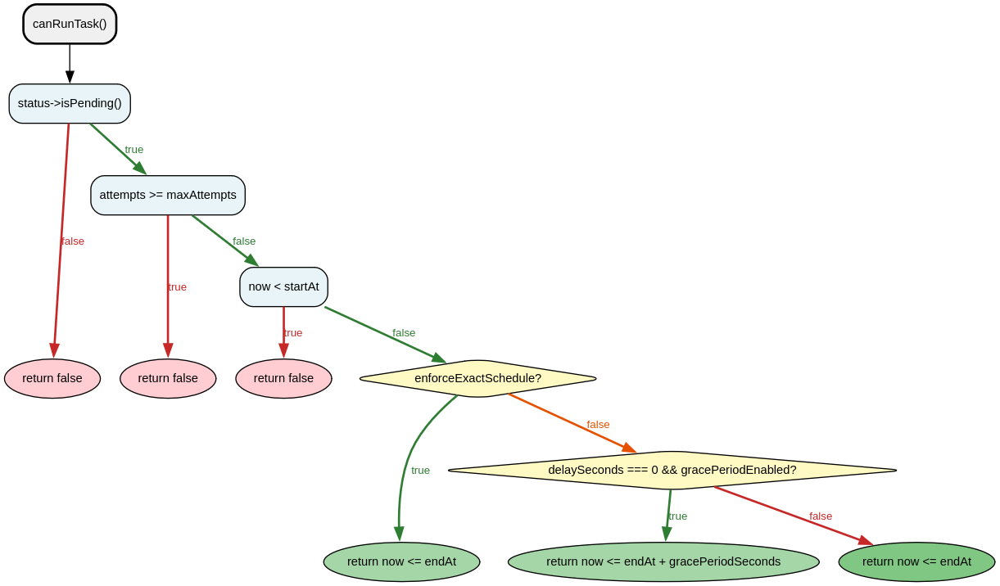

# TaskValidatorService - Référence Technique

## Description

Service de validation des tâches qui détermine si une tâche peut être exécutée, si elle a expiré, et si elle bénéficie de la période de grâce.

## Hiérarchie

```
TaskValidatorService
```

La classe n'étend aucune classe parente et n'implémente aucune interface.

## Rôle principal

Fournir des méthodes de validation pour les tâches uniques et récurrentes, incluant la vérification des fenêtres temporelles, la gestion des tentatives, et le calcul de la période de grâce pour les tâches expirées.

## API / Méthodes publiques

### `__construct(TaskConfig $config): void`

Injecte la configuration du système.

| Paramètre | Type | Description |
|-----------|------|-------------|
| `$config` | `TaskConfig` | Configuration contenant les paramètres de période de grâce |

### `validateTaskClass(string $className): bool`

Valide qu'une classe existe et étend `AbstractTask`.

| Paramètre | Type | Description |
|-----------|------|-------------|
| `$className` | `string` | Nom qualifié complet de la classe à valider |

**Retourne :** `bool` - `true` si la classe est une tâche valide, `false` sinon

**Exemple :**
```php
if (!$validator->validateTaskClass(SendEmailTask::class)) {
    throw new \InvalidArgumentException('Invalid task class');
}
```

### `canRunTask(TaskRecord $task): bool`

Vérifie si une tâche unique peut être exécutée.

| Paramètre | Type | Description |
|-----------|------|-------------|
| `$task` | `TaskRecord` | Tâche à vérifier |

**Retourne :** `bool` - `true` si la tâche peut être exécutée, `false` sinon

**Exemple :**
```php
if ($validator->canRunTask($task)) {
    $runner->runTask($task);
}
```

### `isTaskExpired(TaskRecord $task): bool`

Vérifie si une tâche unique a expiré.

| Paramètre | Type | Description |
|-----------|------|-------------|
| `$task` | `TaskRecord` | Tâche à vérifier |

**Retourne :** `bool` - `true` si la tâche a expiré, `false` sinon

### `shouldRunRecurringNow(RecurringTaskRecord $task): bool`

Vérifie si une tâche récurrente doit être exécutée maintenant.

| Paramètre | Type | Description |
|-----------|------|-------------|
| `$task` | `RecurringTaskRecord` | Tâche récurrente à vérifier |

**Retourne :** `bool` - `true` si la tâche doit être exécutée, `false` sinon

### `shouldRunTaskNow(TaskRecord $task): bool`

Vérifie si une tâche unique doit être exécutée (sans période de grâce).

| Paramètre | Type | Description |
|-----------|------|-------------|
| `$task` | `TaskRecord` | Tâche à vérifier |

**Retourne :** `bool` - `true` si la tâche doit être exécutée, `false` sinon

### `getDelaySecondsForTask(TaskRecord $task): int`

Retourne le délai d'une tâche.

| Paramètre | Type | Description |
|-----------|------|-------------|
| `$task` | `TaskRecord` | Tâche source |

**Retourne :** `int` - Délai en secondes

### `getGracePeriodDelay(TaskRecord $task): int`

Calcule le retard d'une tâche expirée par rapport à sa période de grâce.

| Paramètre | Type | Description |
|-----------|------|-------------|
| `$task` | `TaskRecord` | Tâche expirée |

**Retourne :** `int` - Nombre de secondes de retard (0 si la tâche n'est pas éligible)

### `isUniqueTaskWithGracePeriod(TaskRecord $task): bool`

Vérifie si une tâche unique est éligible à la période de grâce.

| Paramètre | Type | Description |
|-----------|------|-------------|
| `$task` | `TaskRecord` | Tâche à vérifier |

**Retourne :** `bool` - `true` si la tâche bénéficie de la période de grâce, `false` sinon

## Cas d'utilisation

### Cas 1 : Vérification de l'exécutabilité d'une tâche

```php
<?php

declare(strict_types=1);

$validator = new TaskValidatorService($config);

// Tâche dans sa fenêtre d'exécution
$task = new TaskRecord(
    // ... propriétés ...
    startAt: date('c', strtotime('-1 hour')),
    endAt: date('c', strtotime('+1 hour')),
);

if ($validator->canRunTask($task)) {
    echo "La tâche peut être exécutée\n";
}
```

### Cas 2 : Gestion de la période de grâce

```php
<?php

declare(strict_types=1);

$validator = new TaskValidatorService($config);

// Tâche expirée mais dans la période de grâce (24h après endAt)
$task = new TaskRecord(
    startAt: date('c', strtotime('-2 days')),
    endAt: date('c', strtotime('-1 day')),
    delaySeconds: 0,
);

if ($validator->canRunTask($task)) {
    // La tâche s'exécute malgré l'expiration
    $runner->runTask($task);
    
    $delay = $validator->getGracePeriodDelay($task);
    echo "Tâche exécutée avec {$delay} secondes de retard\n";
}
```

### Cas 3 : Validation d'une tâche récurrente

```php
<?php

declare(strict_types=1);

$validator = new TaskValidatorService($config);

$task = new RecurringTaskRecord(
    signature: 'cleanup',
    startAt: date('c', strtotime('-1 hour')),
    nextRunAt: date('c', strtotime('-5 minutes')),
    delaySeconds: 3600,
    // ...
);

if ($validator->shouldRunRecurringNow($task)) {
    $runner->runRecurringTask($task);
    // nextRunAt est automatiquement mis à jour
}
```

## Flux d'exécution



## Gestion des erreurs

| Situation | Comportement | Valeur retournée |
|-----------|--------------|------------------|
| Tâche non pendante | Refus d'exécution | `false` |
| Tentatives max atteintes | Refus d'exécution | `false` |
| `startAt` dans le futur | Refus d'exécution | `false` |
| `endAt` dépassé sans grace period | Refus d'exécution | `false` |
| `endAt` dépassé avec grace period | Acceptation | `true` |
| `enforceExactSchedule = true` | Pas de grace period | `now <= endAt` |

## Intégration

### Dépendances

```
TaskValidatorService
    ├── TaskConfig (configuration)
    └── Carbon (timestamp avec test mock)
```

### Avec TaskBatchService

```php
class TaskBatchService
{
    private function executeUniqueTask(BatchResultRecord $result, TaskRecord $task): BatchResultRecord
    {
        if (!$this->validator->canRunTask($task)) {
            $result = $this->batchResultService->withUniqueTask($result, $task->id, false, 'Task cannot run');
            return $result;
        }
        // ... exécution
    }
}
```

## Performance

| Opération | Complexité | Notes |
|-----------|------------|-------|
| `validateTaskClass()` | O(1) | `class_exists()` + instanciation |
| `canRunTask()` | O(1) | Comparaisons de timestamps |
| `shouldRunRecurringNow()` | O(1) | Comparaisons de timestamps |
| `getGracePeriodDelay()` | O(1) | Simple soustraction |

## Compatibilité

| Version PHP | Support |
|-------------|---------|
| PHP 8.2+ | ✅ Requis (readonly properties) |
| PHP 8.1 | ✅ Complet |
| PHP 8.0 | ❌ |

## Exemple complet

```php
<?php

declare(strict_types=1);

use AndyDefer\Task\Services\TaskValidatorService;
use AndyDefer\Task\Configs\TaskConfig;
use AndyDefer\Task\Enums\TaskStatus;
use AndyDefer\Task\Records\TaskRecord;

// 1. Configuration avec période de grâce activée (24h)
$config = new TaskConfig();
$validator = new TaskValidatorService($config);

// 2. Création d'une tâche expirée
$task = new TaskRecord(
    id: '550e8400-e29b-41d4-a716-446655440000',
    signature: 'backup',
    class: BackupTask::class,
    payload: $payload,
    status: TaskStatus::PENDING,
    createdAt: date('c'),
    startAt: date('c', strtotime('-2 days')),
    endAt: date('c', strtotime('-1 day')),
    delaySeconds: 0,
    attempts: 0,
    maxAttempts: 3,
);

// 3. Vérification
if ($validator->canRunTask($task)) {
    echo "Tâche exécutable (dans la période de grâce)\n";
    
    $delay = $validator->getGracePeriodDelay($task);
    echo "Retard : {$delay} secondes\n";
} else {
    echo "Tâche non exécutable\n";
}

// 4. Vérification de la classe
if (!$validator->validateTaskClass(BackupTask::class)) {
    throw new \InvalidArgumentException('Invalid task class');
}
```

## Voir aussi

- `TaskConfig` - Configuration de la période de grâce
- `TaskRecord` - Record pour les tâches uniques
- `RecurringTaskRecord` - Record pour les tâches récurrentes
- `TaskRunnerService` - Service d'exécution qui utilise ce validateur

---
